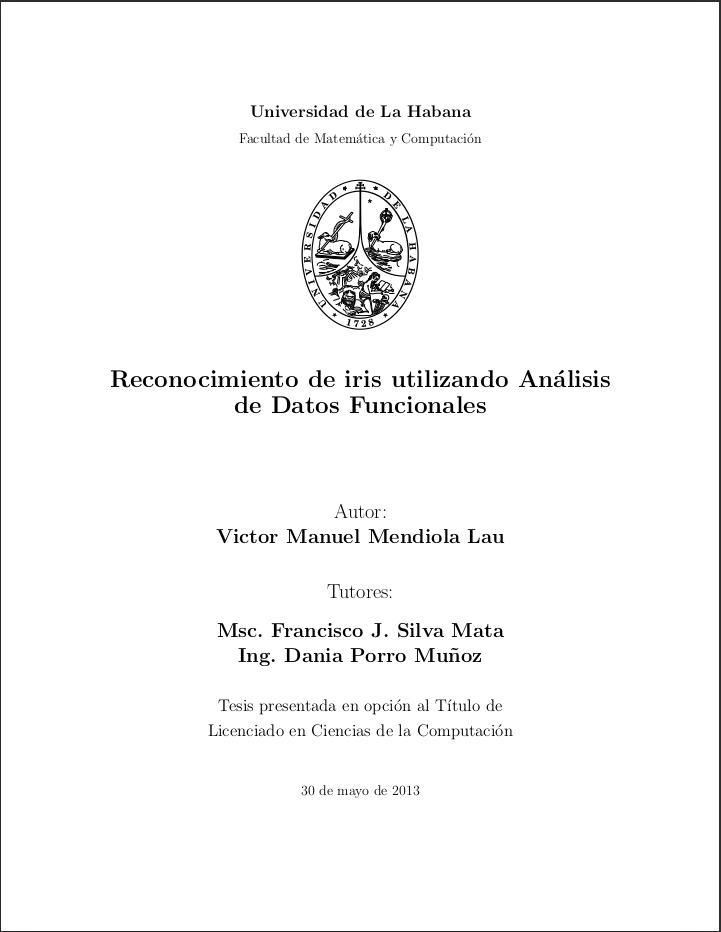

# bsc-thesis-materials

## Thesis

The official report document `Iris-Recognition-using-Functional-Data-Analysis.pdf` is included in the **thesis** folder.

The new approach proposed and its results were included in the [IAPR Conference Paper](https://link.springer.com/chapter/10.1007/978-3-642-41827-3_49): **A New Iris Recognition Approach Based on a Functional Representation**.

